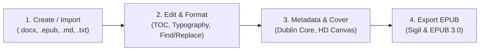

# EPUB 3 Maker & Editor

[](https://takol.github.io/epubEditor/)
[](https://www.w3.org/publishing/epub3/)
[](#privacy-first-architecture)
[](LICENSE)

> **A professional, 100% client-side EPUB 3 ebook editor and packaging tool strictly compliant with Sigil directory structure and IDPF/W3C EPUB 3 standards.**

Launch the live application directly in your browser:  
👉 **[https://takol.github.io/epubEditor/](https://takol.github.io/epubEditor/)**

---

## 🎯 Repository Purpose

This repository (`epubEditor`) serves as the **public release and distribution hub** for the compiled, standalone single-file distribution of **EPUB Maker**.

- **Instant Web Access**: Hosted directly on **GitHub Pages**, accessible anywhere without installation.
- **Zero-Dependency & Offline Ready**: The entire application is bundled into a single standalone file (`index.html`). You can download or clone this repository and open `index.html` directly in any web browser (`file:///` protocol) without needing Node.js, a web server, or an internet connection.
- **Privacy by Design**: No backend server exists. All processing, parsing, and packaging happen completely in your browser's local memory.

---

## ✨ Key Features

### 🔒 100% Client-Side & Privacy-First
- **Zero Server Uploads**: Text parsing (via Mammoth.js), EPUB packaging (via JSZip), and cover rendering (via HTML5 Canvas) operate entirely within your browser memory.
- **Local Storage (`AppDB`)**: Multi-project bookshelf and drafts are persisted in your browser's local **IndexedDB**, eliminating localStorage quota constraints.

### 📐 Sigil & EPUB 3.0 Standard Compliance
- Generates strict, clean Sigil-compatible folder structures:
  - `OEBPS/Text/SectionXXXX.xhtml`
  - `OEBPS/Styles/book.css`
  - `OEBPS/content.opf` & `toc.ncx` & `nav.xhtml`
- Strictly places uncompressed `mimetype` as the first entry in the ZIP package.
- Clean semantic XHTML with escaped XML entities, valid Dublin Core metadata, and customizable copyright pages (`copyright.xhtml`).

### 📂 Multi-Format Import & Round-Trip Editing
- **Start from Scratch**: Create a clean blank book project with one click.
- **Microsoft Word (`.docx`)**: Automatically parses document headings, splits sections, preserves tables, lists, blockquotes, and embeds illustrations.
- **Existing EPUB (`.epub`)**: Open and re-edit any EPUB file with 100% fidelity (recovers all chapters, stylesheets, metadata, and covers).
- **Markdown (`.md`) & Plain Text (`.txt`)**: Drag and drop text files with automatic regex chapter splitting (`#`, `##`, `Chapter X`, `第X章`).

### ✍️ In-Browser Authoring & Typography Tools
- **Horizontal & Vertical Reading Simulation**: Switch between LTR horizontal reading and RTL vertical Japanese/Chinese typesetting (縱書).
- **Smart Typography Helpers**:
  - One-click batch indent optimization.
  - Punctuation standardization (CJK full-width/half-width rules).
  - Whole-book batch formatting.
- **Versatile Chapter Types**:
  - Regular content sections.
  - Part/Divider transition pages (部次 / 引言分隔頁).
  - Dedicated illustration pages with caption and placement controls.
- **Drag & Drop Table of Contents**: Reorder chapters freely with automatic section renumbering.
- **Global Search & Replace**: Cross-chapter search modal (`Cmd+Shift+F` / `Ctrl+Shift+F`) supporting regular expressions and batch replacement.

### 🎨 Built-in High-Resolution Canvas Cover Generator
- Generate 1200×1800 HD book covers with custom gradients, typography, and subtitles directly in the browser.
- Supports uploading custom cover images (`.png`, `.jpg`).
- Real-time resolution and file-size indicators.

### ☁️ Optional Google Drive Sync
- Optional Google Drive integration for multi-device sync and cloud backup with custom folder selection and conflict prevention timestamps.

### 📦 Multiple Export Options
- **Standard EPUB 3.0 (`.epub`)**: Production-ready ebook compatible with Apple Books, Google Play Books, Kobo, Kindle, and Sigil.
- **Chapter XHTML Archive (`.zip`)**: Individual XHTML chapters and assets for manual inspection.
- **Clean Markdown (`.md`) & Text (`.txt`)**: Consolidated text exports for archiving or cross-platform publishing.

---

## 🚀 User Quick Start Guide

### Option 1: Use Online (Recommended)
Visit the live GitHub Pages app:  
➡️ **[https://takol.github.io/epubEditor/](https://takol.github.io/epubEditor/)**

### Option 2: Run Locally (Offline Mode)
1. Clone this repository or download [`index.html`](file:///Users/takol/project/epubEditor/index.html):
   ```bash
   git clone https://github.com/takol/epubEditor.git
   ```
2. Double-click `index.html` to open it in Chrome, Safari, Edge, or Firefox.  
   *(No installation, build tools, or terminal commands required!)*

---

### Step-by-Step Workflow



#### Step 1: Start a Project
- **Create a Blank Book**: Click **"Start from Scratch"** to begin writing with a default template.
- **Import an Existing Document**: Drag and drop a `.docx`, `.epub`, `.md`, or `.txt` file onto the dropzone. The editor will automatically parse chapters and load all contents into the workspace.

#### Step 2: Edit and Structure Chapters
- **Write and Format**: Use the central WYSIWYG editor to adjust your content.
- **Reorder Chapters**: Drag and drop chapter items in the Table of Contents sidebar to adjust the reading order.
- **Typography Cleanup**: Use the toolbar to apply automatic paragraph indentation or standardize punctuation across single chapters or the entire book.
- **Global Search**: Press `Cmd+Shift+F` (Mac) or `Ctrl+Shift+F` (Windows/Linux) to find and replace text across all chapters.

#### Step 3: Set Metadata & Cover
- Click **"Book Info" (Metadata)** in the left sidebar to configure:
  - Book Title, Creator/Author, Publisher, Category, Language, and Identifier (ISBN/UUID).
  - Page direction: Horizontal (LTR) or Vertical (RTL).
  - Version info visibility on the TOC and copyright pages.
- Click **"Cover"** to either upload an image or use the built-in generator to design a 1200×1800 cover in seconds.

#### Step 4: Preview & Export
- Toggle between **Horizontal** and **Vertical** reading simulations in the toolbar.
- Click **"Download EPUB (.epub)"** in the sidebar to download your publication-ready EPUB 3 ebook.

---

## 🛡️ Data Safety & Backup Golden Rule

> [!IMPORTANT]
> **Your data is saved in your current browser's local IndexedDB.**  
> Clearing your browser cache, browsing in Incognito/Private mode, or switching browsers will not carry over your drafts.
> 
> **Always download your book as an `.epub` file when you finish editing.**  
> Because the output `.epub` contains all chapters, styles, metadata, and high-resolution covers, it acts as a **100% complete backup**. You can restore and continue editing your book at any time simply by dragging the `.epub` file back into this tool.

---

## 📁 Repository Structure

```text
epubEditor/
├── index.html        # Single-file standalone web app (HTML + CSS + JS bundled)
├── privacy.html      # Privacy policy
├── terms.html        # Terms of service
├── LICENSE           # MIT License
└── README.md         # Repository documentation and user guide
```

---

## 📄 License & Terms

- **License**: [MIT License](LICENSE) &copy; 2026 Takol Liu.
- **Privacy Policy**: [Privacy Policy](privacy.html)
- **Terms of Service**: [Terms of Service](terms.html)
